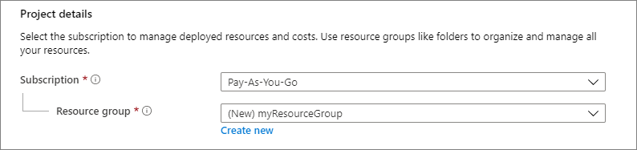
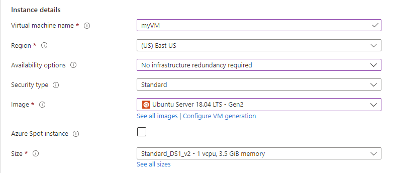

# Create a Linux virtual machine in the Azure portal

Azure virtual machines (VMs) can be created through the Azure portal. The Azure portal is a browser-based user interface to create Azure resources. This quickstart shows you how to use the Azure portal to deploy a Linux virtual machine (VM) running Ubuntu Server 22.04 LTS. To see your VM in action, you also SSH to the VM and install the NGINX web server.

<b>Step one:</b> Create virtual machine

<b>Step two:</b> Enter virtual machines in the search.

<b>Step three:</b> Under Services, select Virtual machines.

<b>Step four:</b> In the Virtual machines page, select Create and then Virtual machine. The Create a virtual machine page opens.

<b>Step five:</b> In the Basics tab, under Project details, make sure the correct subscription is selected and then choose to Create new resource group. Enter myResourceGroup for the name.

<b>Step six:</b> Under Instance details, enter myVM for the Virtual machine name. Under Availability options, select No infrastructure redundancy required. Under Security type, select Standard. Choose Ubuntu Server 22.04 LTS - Gen2 for your Image. Leave the other defaults. The default size and pricing is only shown as an example. Size availability and pricing are dependent on your region and subscription.

<b>Step seven:</b> Under Administrator account, for Authentication type, select SSH public key.

<b>Step eight:</b> In Username enter azureuser.

<b>Step nine:</b> For SSH public key source, leave the default of Generate new key pair, and then enter myKey for the Key pair name.

<b>Step ten:</b> Under Inbound port rules > Public inbound ports, choose Allow selected ports and then select SSH (22) and HTTP (80) from the drop-down.

<b>Step eleven:</b> Leave the remaining defaults and then select the Review + create button at the bottom of the page. A final validation runs.

<b>Step twelve:</b> On the Create a virtual machine page, review the details about the VM you're about to create. When you're ready, select Create.

<b>Step thirteen:</b> When the Generate new key pair window opens, select Download private key and create resource. Your key file will be download as myKey.pem. Make sure you know where the .pem file was downloaded; you'll need the path to it in the next step.

<b>Step fourteen:</b> When the deployment is finished, select Go to resource.

<b>Step fifteen:</b> On the page for your new VM, select the public IP address and copy it to your clipboard.
