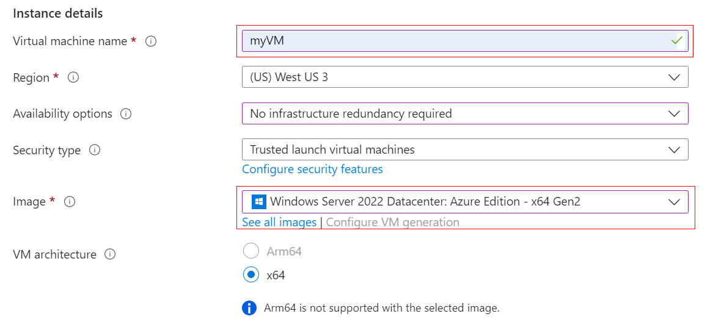
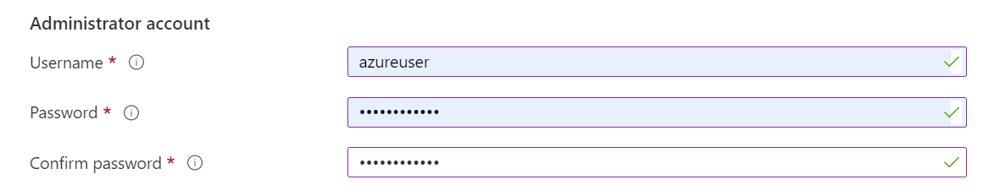
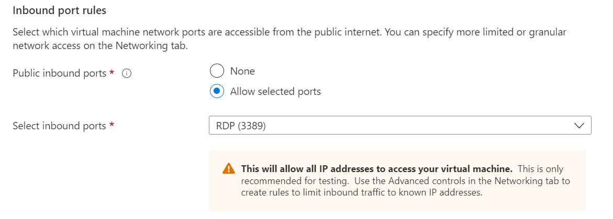
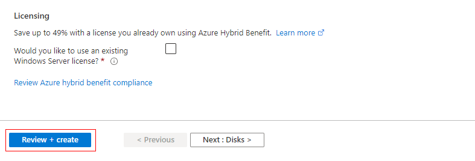
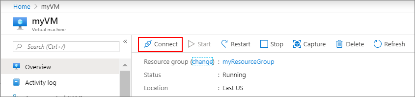

# Create a Windows virtual machine in the Azure portal

Azure virtual machines (VMs) can be created through the Azure portal. This method provides a browser-based user interface to create VMs and their associated resources. This quickstart shows you how to use the Azure portal to deploy a virtual machine (VM) in Azure that runs Windows Server 2022 Datacenter. To see your VM in action, you then RDP to the VM and install the IIS web server.

## Sign in to Azure

Sign in to the Azure portal.

## Create virtual machine

<b>Step 1:</b> Enter virtual machines in the search.

<b>Step 2:</b> Under Services, select Virtual machines.

<b>Step 3:</b> In the Virtual machines page, select Create and then Azure virtual machine. The Create a virtual machine page opens.

<b>Step 4:</b> Under Instance details, enter myVM for the Virtual machine name and choose Windows Server 2022 Datacenter: Azure Edition - x64 Gen 2 for the Image. Leave the other defaults.

Note: Some users will now see the option to create VMs in multiple zones. To learn more about this new capability, see Create virtual machines in an availability zone. Screenshot showing that you have the option to create virtual machines in multiple availability zones.

<b>Step 5:</b> Under Administrator account, provide a username, such as azureuser and a password. The password must be at least 12 characters long and meet the defined complexity requirements.

<b>Step 6:</b> Under Inbound port rules, choose Allow selected ports and then select RDP (3389) and HTTP (80) from the drop-down.

<b>Step 7:</b> Leave the remaining defaults and then select the Review + create button at the bottom of the page.

<b>Step 8:</b> After validation runs, select the Create button at the bottom of the page. Screenshot showing that validation has passed. Select the Create button to create the VM.

<b>Step 9:</b> After deployment is complete, select Go to resource.

